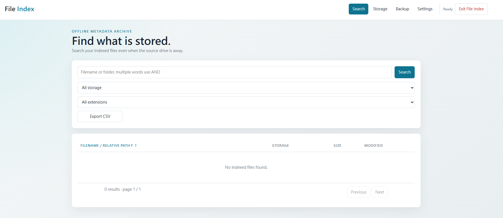
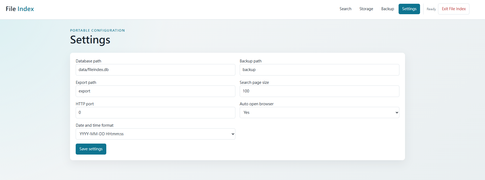

# File Index System

**English** | [繁體中文](README.md)

<p align="center"></p>

## Project origin

This project was inspired by **CD Index 光碟索引大師**, freeware written by Tsai Ming-Hsiu (蔡明修). After using it for many years, I found it to be a very practical utility. On my current system, however, it sometimes reports an error after being left idle for too long. With AI development tools becoming widely available, I asked AI to help define the specification and develop this project.

For an introduction to **CD Index 光碟索引大師**, see [布丁布丁吃什麼？— CD Index 光碟索引大師](https://blog.pulipuli.info/2016/05/cd-index-cd-index-download.html).

File Index System is a portable, offline file metadata indexer based on the V1 specification. It stores filenames, relative paths, sizes, and modification times in SQLite so indexed files remain searchable when their source storage is offline.

## Features

- Filename and relative-path search with multi-keyword AND, storage and extension filters, four-step filename/path sorting, and pagination
- Add, edit, locate, rescan, export, and delete storage indexes
- Atomic staging scans with cancellation support
- Asynchronous UTF-8 BOM CSV exports
- Validated SQLite backup and complete restore with an automatic safety backup
- Portable JSON settings for page size, HTTP port, browser launch, and date-time display format
- Reveal and select indexed files in Windows, macOS, and Linux desktops that support `org.freedesktop.FileManager1`

## Screenshots





## Using the interface

- The three-line introduction appears at the bottom right of the page, leaving the Search workspace for filters and results.
- **Help / 使用說明** at the bottom of **Settings** provides tab-styled links to the user guide, settings field reference, and Storage field reference. Each opens in a new tab. The help content is currently in Traditional Chinese and is bundled with the application for offline access.

- Search starts with no results. Use Search, a filter, or View files to display indexed files.
- Storage Details uses bold field labels. Filesystem and Capacity are recorded after a successful Scan/Rescan; rescan older indexes to populate them. Capacity is the containing volume's total capacity, not folder size or free space; Windows quotas may affect the reported capacity. Missing values display Unavailable. Relocate preserves the previous scan's volume information.

- Click **Filename / Relative Path** repeatedly to cycle through filename ascending, path plus filename ascending, filename descending, and path plus filename descending. The `F` or `P+F` marker and arrow show the active mode.
- Click **Storage**, **Size**, or **Modified** to sort ascending; click the same heading again to switch between ascending and descending.
- File sizes automatically use B, KB, MB, GB, TB, or PB. The number and unit may wrap separately on narrow screens.
- Dates and times use the format selected under **Settings → Date and time format**. The date and time may wrap onto separate lines.
- Click a search result to view its details. **Open Folder** opens the containing folder and selects the file when the desktop platform supports it.
- **Open File** in File details opens the source file with the operating system's default application for that file type. The source must be online and the file must still exist; opening occurs only after an explicit user click.
- **Relative path** in File details is the folder path relative to the Storage scan root and excludes the filename. Files directly in the root display `(Storage root)`.
- On Windows, **Open Folder** passes the selection switch and full file path to File Explorer separately. PDF, text, Office, image, and extensionless files use the same flow, including paths containing spaces, commas, or Chinese characters.
- Scan progress, **Cancel scan**, and **Exit File Index** appear in the top navigation area to the right of **Settings**.

**Rescan** immediately scans the stored current source directory and updates its index without asking for a Root path. After **Relocate**, it scans the new location. If the source is unavailable, reconnect it or relocate it first. **Relocate** changes only the source location without scanning or changing the existing file index.

After **Exit File Index** successfully requests shutdown, the status changes to `Stopping server…`, then to `Server stopped` when the service disconnects, and the controls are disabled. If a scan is running, you are first asked whether to cancel it and exit; declining keeps the application available. Closing the browser tab alone does not stop the background program.

Exit File Index attempts to close the current tab after the service stops. If the browser blocks automatic closing, the Server stopped message remains visible; close the tab manually. Other tabs are unaffected.

### Deleting Storage and reclaiming database space

Deleting a Storage also deletes its file index. SQLite `auto_vacuum=FULL` reclaims free pages at commit to shrink the database without deleting source files. Small deletions may not free a whole page, so the file size can stay unchanged. Existing databases (including restored databases) are converted on first opening, which may take time and extra disk space; subsequent openings do not rebuild the whole database.

Only the selected Storage and its index are deleted; other Storages remain intact. Existing backups retain their original indexes, so restoring an older backup may bring back a deleted Storage.

## Development mode

Development requires Go 1.22 or newer. Run these commands from the project directory containing `go.mod`:

```powershell
go mod tidy
go run .
```

`go run .` uses the project directory as the portable root. For regular use, build a native executable as described below. A built application does not require Go and can be started outside the project directory.

The server listens only on `127.0.0.1`. It opens the default browser when configured to do so. If automatic browser launch is disabled, open the one-time session URL printed in the terminal.

## Windows

### Build

Run in PowerShell:

```powershell
go build -o FileIndex.exe .
```

A successful `go build` normally prints no message. Confirm that `FileIndex.exe` was created in the project directory.

Start the application by double-clicking `FileIndex.exe` or from PowerShell:

```powershell
.\FileIndex.exe
```

### Executable icon

The repository includes `icon_windows_amd64.syso`, generated from `image/FileIndex.ico`. Ordinary `go build -o FileIndex.exe .` therefore embeds the Windows x64 icon. Neither ICO nor SYSO needs to accompany the executable. If Explorer caches an old icon, refresh or copy the new executable to another folder to check.

## Cross-platform releases with icons

Requires Go 1.22+ and Python 3.9+ (usually `python3` on macOS/Linux). Run from the project root:

```powershell
python scripts/build.py --target all
```

Or build an individual target:

```powershell
python scripts/build.py --target windows-amd64
python scripts/build.py --target darwin-arm64
python scripts/build.py --target darwin-amd64
python scripts/build.py --target linux-amd64
```

The same commands work on Windows, macOS, and Linux; target settings apply only to child processes. Output is in `dist/`: ZIP for Windows, TAR.GZ with executable permissions for macOS/Linux. Archives exclude existing indexes, settings, and backups. End users do not need Go. Minimum OS requirements also depend on the Go toolchain used to build.

| Platform | Icon and launch method |
| --- | --- |
| Windows x64 | Extract and double-click `FileIndex.exe`; its icon is embedded. |
| macOS Apple Silicon / Intel | Extract the matching architecture on a Mac, then double-click `FileIndex.app`; bundled ICNS supplies its Finder icon. |
| Linux x64 | Extract and run `./FileIndex`, or use the desktop launcher below for an icon and menu entry. |

### macOS

Keep the whole `.app` bundle. Settings, database, backups, and exports are stored **beside** it. Extract into a writable directory and move the bundle together with its data directories.

Packages are not Developer ID signed or notarized. First launch may require approval under **System Settings → Privacy & Security**. Plain `go build -o FileIndex .` still produces a command-line executable; use the `.app` package for a Finder icon.

### Linux

Run inside the extracted package (Python 3 is needed only to set up the launcher):

```bash
python3 install-desktop.py
```

This creates `FileIndex.desktop` beside the program and installs a user application-menu entry without administrator privileges. It refers to `FileIndex.png` by absolute path. Run again after moving the folder, changing the USB mount path, or switching computers. Some desktops require marking the launcher as trusted / allowing launch.

Icons appear in Desktop Entry-compatible launchers and menus; file managers do not guarantee a custom icon on the raw ELF executable. macOS/Linux do not directly use Windows ICO resources. The UI still opens in a browser; packaging does not replace the browser's own Dock/taskbar icon.

### Changing artwork

Windows uses `image/FileIndex.ico`; macOS/Linux use the matching high-resolution `image/FileIndex-logo.png`. Replace both sources, then regenerate resources and packages:

```powershell
python -m pip install Pillow
python scripts/build.py --refresh-icons --target all
```

Normal builds use the checked-in SYSO and `image/FileIndex.icns`, requiring neither Pillow nor an icon-tool download. Only `--refresh-icons` uses Pillow for ICNS conversion and downloads/runs pinned `github.com/akavel/rsrc@v0.10.2` via Go for Windows resources. Commit the regenerated artifacts together. Replacing artwork does not update existing executables.

## Portable directory

A built executable uses its own directory as the portable root (beside the bundle for macOS `.app`). The recommended layout is:

```text
FileIndex/
├── FileIndex.exe, FileIndex, or FileIndex.app
├── config/
│   └── config.json
├── data/
│   └── fileindex.db
├── backup/
└── export/
```

`database_path`, `backup_path`, and `export_path` must be relative to the portable root. The application can therefore be launched from a shortcut, shell script, Finder, or an application menu while continuing to use the same data beside the executable.

## Remaining platform work

Native directory and database-file pickers and filesystem identity comparison remain platform-integration work. Validated path fields currently provide the corresponding workflows.
